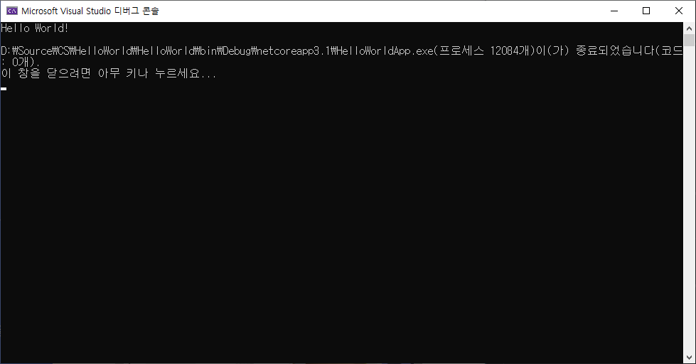

# HTML 학습 리포지토리
HTML5, CSS3, JS 학습용 리포지토리

---------------------------------------

## HTML5
HTML 기본 학습

### HTML이란?
개요에 대해서 학습합니다.
1. Hyper Text Markup Language 정의
2. HTML 역사
3. HTML5의 차이점

* Hyper Text Markup *Language* 정의
  - __HTML__ _역사_
  + **HTML5**의 ~차이점~

```cs
using system.IO;

namespace HelloWorldApp {
  public class Program {
    public static void Main(String[] args){
      Console.WriteLine("Hello world");
      //Hello World 1lI0oOㅇ 코딩폰트 구별 가능
    }
  }
}
```


```


```


참조링크
--------
- [Microsoft](https://www.microsoft.com "마이크로소프트")
- [Naver](https://www.naver.com "네이버")
---------------------------------------

## CSS3
CSS 기본 학습

> CSS is Cascading Style Sheets.

`테스트 코드`

-[]공부하긔

---------------------------------------

## JavaScript 
JavaScript 기본 학습

---------------------------------------

## Responsive Web
응답형 웹 기본 학습

---------------------------------------

## Project
전체 통합 프로젝트

-------
문의 메일 : <am3251@naver.com>
